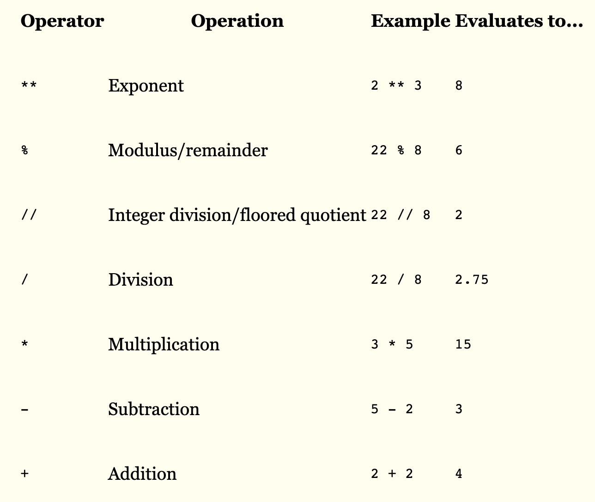
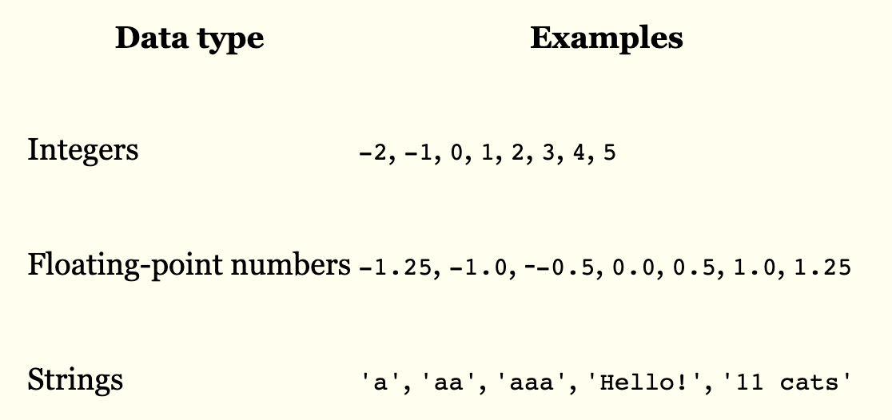

## Python basic

:point_right: expression

```
>>> 1 + 1
2
>>> 2 * 2
4
```
:point_right: math operators



:point_right: data type ==> integer, floating-point,string 


:point_right: string concatening, string replication
```
'cgh2' + ' and python101'
cgh2 and python101

>'cgh2'*3
cgh2cgh2cgh2

>>>'cgh2' + 123
```
:point_right: storing value in variable
```
>>>my_value = 7

>>>my_value

>>>my_second_value = 9

>>>my_value + my_second_value

>>>my_string = 'cgh2'

>>>my_second_string='python101'

>>>my_string + ' ' + my_second_string

```
:point_right:variable name
1. it can be only 1 word
2.usually letters, numbers,and '_'
3.it cannot begin with number  

```


:point_right: your first program

```
print ('what is your name ?')
your_name = input()
print ('hello, '+ your_name)
print ("your name's length is : " + str(len(your_name)))

print ('what is your age ? ')
your_age = input()
print ('your age  is : ' + str(your_age))
```

