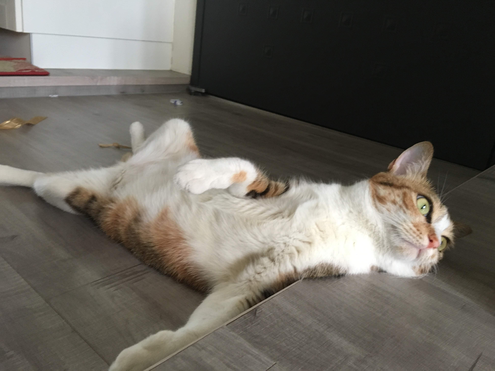

## chapter 1

#### some things you  should know before starting learn pytohn

- **python2  or python 3**, which one?
- **virtualenv** : what and why?
- **python module** : must know and must learn to use
- **bpython** : realtime coding demo
- **github** : must know and ~~must learn to use~~ 
- **codind tools** : depends on you
  - [visual studio code](https://code.visualstudio.com/)
  - [pycharm](https://www.jetbrains.com/pycharm/)
  - [sublime text](https://www.sublimetext.com/)
  - [notepad++](https://notepad-plus-plus.org/zh/)
  - VIM

## chapter 2

#### reading and  writing files

###### using `os.getcwd()` to get curretn directory , `os.change_dir()` to change the directory you want

```python

```

import os
import sys

current_dir = os.getcwd()
change_dir = os.chdir()

print (f'current_dir : {current_dir}')
print (f'change_dir : {change_dir}')

```python

```

